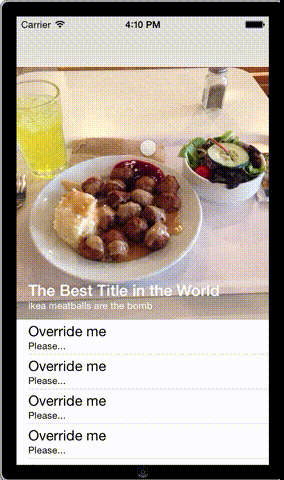

# ParallaxBlur

ParallaxBlur aims the be an easy-to-use implementation of a UITableController with a parallax header.  It is screen resolution independant, orientation indendant, and will automatically adjust if there is a navigation bar in place.

Inspiration was taken from Aaron Pang's [SecretViewer](https://github.com/aaronpang/SecretViewer).  I liked the way it looked and behaved, but it wasn't extremely customizable, and not setup to be used as a Pod.

## Usage

Usage is pretty simple.  Subclass `JPBFloatingTextViewController` and then customize it within `viewDidLoad`:

    [self setHeaderImage:[UIImage imageNamed:@"meatballs.jpeg"]];
    [self setTitleText:@"The Best Title in the World"];
    [self setSubtitleText:@"ikea meatballs are the bomb"];

You should override the required `UITableViewDatasource` and `UITableViewDelegate` methods to supply the content section with cells and handle user selections.

## Example

To run the example project, clone the repo, and run `pod install` from the Example directory first.

## Requirements

iOS 7.0 or higher.

## Installation

ParallaxBlur is available through [CocoaPods](http://cocoapods.org). To install
it, simply add the following line to your Podfile:

    pod "ParallaxBlur"

## Author

pyro2927, joseph@pintozzi.com

## License

ParallaxBlur is available under the MIT license. See the LICENSE file for more info.

